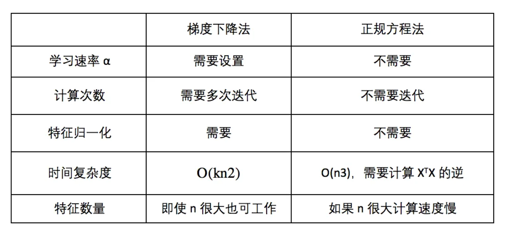

# 03 正规矩阵法拟合

​	对于$m$个样本，每个样本含有$n$个特征，令第$i$个样本$x^{(i)} = \begin{bmatrix} 1 \\ x_1^{(1)} \\ x_2^{(1)} \\ \vdots \\ x_n^{(1)}\end{bmatrix}$，构建矩阵$X = \begin{bmatrix}(x^{(1)})^T \\ (x^{(2)})^T \\ \vdots \\ (x^{(n)})^T \end{bmatrix}$，即一行一个样本。

​	同时构建$y = \begin{bmatrix} y^{(1)} \\ y^{(2)} \\ \vdots \\ y^{(n)}\end{bmatrix}$。

**方法1：对损失函数求导**

​	代价函数$J(\theta) = \frac{1}{2m} \sum_{i = 1}^{m}(h_\theta(x^{(i)})-y^{(i)})^2$。

​	写成矩阵形式为$J(\theta) = \frac{1}{2m} (X\theta-y)^T(X\theta-y)$。

​	令$J(\theta) = 0$，得到方程$\frac{1}{2m} (X\theta-y)^T(X\theta-y) = 0$，两边求导，得到$\theta = (X^TX)^{-1}X^Ty$。

**方法2：解$y=X\theta$**方程

​	左乘$X^T$，使得$X^TX$为方阵：$X^Ty = X^TX\theta$

​	左乘$(X^TX)^{-1}$，得到$\theta = (X^TX)^{-1}X^Ty$。

## 正规矩阵使用场景

​	在特征超过上万时，建议使用梯度下降，否则可以使用正规矩阵法。另外需要保证$X^TX$可逆。

## 何时$X^TX$不可逆

* 包含了多余的特征，例如：
  * $x_1 = size$  $in$  $feets^2$
  * $x_2=size$  $in$  $m^2$
  * 解决方案：删除多余的特征

* 特征少于样本数量（$m \leq n$）
  * 解决方案：
    * 删除一些特征
    * 使用正则化的方法
* 其它解决方案：使用伪逆函数来计算逆矩阵，即使矩阵不可逆也可以算出对应的逆矩阵。