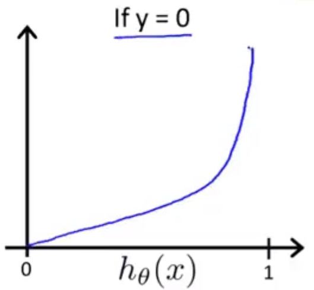
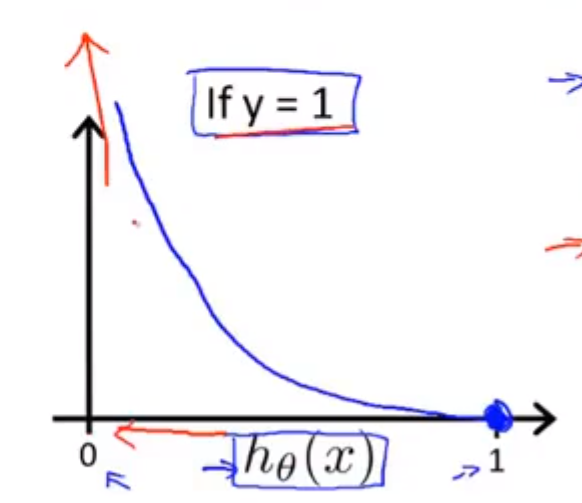

# 04 logistics回归

​	假设存在两个函数：$h_\theta(z) = \frac{1}{1+e^{-z}}$，以及$g(x)$，其中，$z = g(x)$。

​	其中，$g(x)$为决策边界的函数，用于将函数平面划分成两个区域，不同区域的函数值分别大于/小于0。

​	由于原有的代价函数会出现多个局部最优点，因此创建新的代价函数$Cost(h_\theta(x^{(i)}),y^{(i)}) = \begin{cases} -log(h_\theta(x)),&y = 1\\-log(1-h_\theta(x)),&y=0 \end{cases} $，即$Cost(h_\theta(x^{(i)}),y^{(i)}) = -y log(h_\theta(x))-(1-y)log(1-h_\theta(x))$

​	**代价函数图示：**

​	分析：

* $h_\theta(x)\rightarrow1,y=1,Cost\rightarrow0$
* $h_\theta(x)\rightarrow0,y=1,Cost\rightarrow\infty$
* $h_\theta(x)\rightarrow0,y=0,Cost\rightarrow0$
* $h_\theta(x)\rightarrow1,y=0,Cost\rightarrow\infty$

综上，$J(\theta)=\frac{1}{m}\sum_{i=1}^{m}Cost(h_\theta(x^{(i)}),y^{(i)})=\frac{1}{m}[\sum_{i=1}^{m}-y log(h_\theta(x))-(1-y)log(1-h_\theta(x))]$

## 梯度下降

​	$\theta_j = \theta_j - \alpha\sum_{i=1}^{m}(h_\theta(x^{(i)})-y^{(i)})x_j^{(i)}$